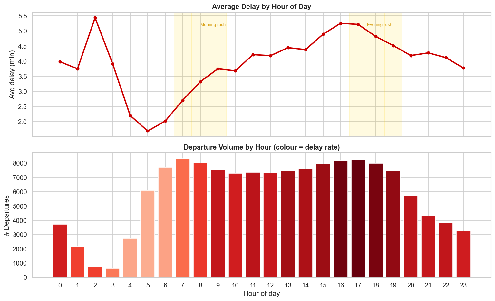
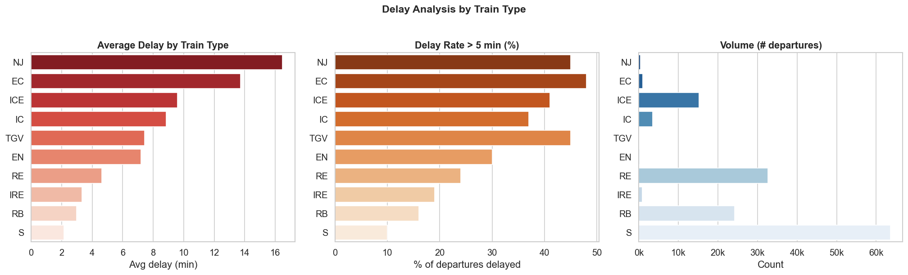
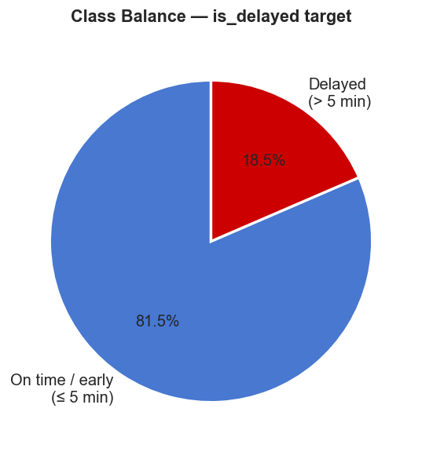
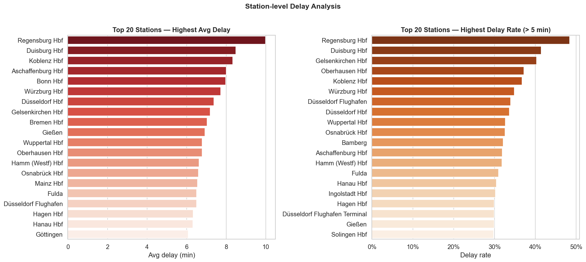

# DB Delay Predictor

End-to-end ML system that predicts whether a Deutsche Bahn departure will be delayed more than 5 minutes, served as a REST API.

Built on top of the ETL pipeline from [db-train-delay-analytics](https://github.com/your-org/db-train-delay-analytics).

## Architecture

```
HuggingFace (piebro/deutsche-bahn-data)
        │
        ▼
collect_data.py ──── PostgreSQL (db-train-delay-analytics)
        │
        ▼
data/training_data.csv  (141 k rows)
        │
        ▼
features.py  ──  train.py  ──►  models/best_model.joblib
                                         │
                                         ▼
                                      api.py  (FastAPI)
                                         │
                                         ▼
                              POST /predict  →  delay_probability
```

## Project Structure

```
db-delay-predictor/
├── data/
│   └── training_data.csv       # 141 k rows from HuggingFace + PostgreSQL
├── models/
│   ├── best_model.joblib       # trained XGBoost classifier
│   ├── encoders.joblib         # fitted feature encoders
│   └── best_model_meta.joblib  # name, metrics, feature list
├── notebooks/
│   └── eda.ipynb               # exploratory data analysis
├── src/
│   ├── collect_data.py         # data pipeline (HuggingFace + PostgreSQL)
│   ├── features.py             # feature engineering
│   ├── train.py                # model training & evaluation
│   └── api.py                  # FastAPI prediction endpoint
├── Dockerfile
├── docker-compose.yml
└── requirements.txt
```

## Exploratory Data Analysis

| Delays by Hour | Delays by Train Type |
|---|---|
|  |  |

| Class Balance | Delay by Station |
|---|---|
|  |  |

Key findings:
- **18.5% delay rate** overall (delay > 5 min)
- Peak delays during **morning (7–9 h) and evening (16–19 h) rush hours**
- **IC/EC trains** have the highest delay rates; S-Bahn the lowest
- Strong station-level variance — certain hubs are systematically late

## Features

| Feature | Description |
|---|---|
| `hour` | Departure hour (0–23) |
| `day_of_week` | 0 = Monday … 6 = Sunday |
| `is_weekend` | 1 if Saturday or Sunday |
| `is_rush_hour` | 1 if 6–9 h or 16–19 h |
| `is_night` | 1 if 0–5 h or 22–23 h |
| `train_type_encoded` | Ordinal: worst punctuality = 0 |
| `station_encoded` | Ordinal: ranked by avg delay |
| `hist_avg_delay_station` | Mean delay at this station (training set) |
| `hist_delay_rate_station` | Fraction delayed > 5 min at this station |
| `hist_avg_delay_train_type` | Mean delay for this train type |

## Model Results

| Model | Accuracy | Precision | Recall | F1 | ROC-AUC |
|---|---|---|---|---|---|
| Logistic Regression | 0.6798 | 0.3286 | 0.6999 | 0.4473 | 0.7545 |
| Random Forest | 0.6999 | 0.3549 | 0.7602 | 0.4839 | 0.7973 |
| **XGBoost** ✓ | **0.7174** | **0.3670** | **0.7262** | **0.4876** | **0.7989** |

XGBoost selected as best model by F1 score. Class imbalance (81.5% / 18.5%) addressed with `scale_pos_weight=4`.

## Quickstart

### Local

```bash
python -m venv .venv && source .venv/bin/activate
pip install -r requirements.txt

# Collect data (HuggingFace only, no PostgreSQL required)
python src/collect_data.py --no-postgres

# Train models
python src/train.py

# Start API
uvicorn src.api:app --reload
```

### Docker

```bash
docker compose up --build
```

API available at `http://localhost:8000`. Interactive docs at `http://localhost:8000/docs`.

## API Reference

### `POST /predict`

Predict delay probability for a departure.

```bash
curl -X POST http://localhost:8000/predict \
  -H "Content-Type: application/json" \
  -d '{"station": "Köln Hbf", "train_type": "ICE", "hour": 17, "day_of_week": 3}'
```

**Response**
```json
{
  "station": "Köln Hbf",
  "train_type": "ICE",
  "hour": 17,
  "day_of_week": 3,
  "delay_probability": 0.8389,
  "prediction": "delayed"
}
```

| Field | Type | Description |
|---|---|---|
| `station` | string | Station name (case-insensitive) |
| `train_type` | string | `ICE`, `IC`, `RE`, `RB`, `S`, etc. |
| `hour` | int | Departure hour 0–23 |
| `day_of_week` | int | 0 = Monday … 6 = Sunday |

### `GET /health`

```bash
curl http://localhost:8000/health
# {"status": "ok"}
```

### `GET /model/info`

```bash
curl http://localhost:8000/model/info
```

```json
{
  "model_name": "XGBoost",
  "metrics": {"Accuracy": 0.7174, "F1": 0.4876, "ROC-AUC": 0.7989},
  "features": ["hour", "day_of_week", "is_weekend", "is_rush_hour", "is_night",
               "train_type_encoded", "station_encoded",
               "hist_avg_delay_station", "hist_delay_rate_station",
               "hist_avg_delay_train_type"]
}
```

## Data Sources

- **HuggingFace** — [`piebro/deutsche-bahn-data`](https://huggingface.co/datasets/piebro/deutsche-bahn-data) (streamed, 200 k rows default)
- **PostgreSQL** — raw delay records from [db-train-delay-analytics](https://github.com/your-org/db-train-delay-analytics)
